# 2025年排名前20的比特币VPS服务商盘点(最新整理)

想用加密货币租服务器,又担心泄露身份信息?传统VPS主机要求信用卡实名,银行流水一目了然,对注重隐私的用户来说实在不够友好。好消息是,现在越来越多云服务商支持比特币、以太坊等加密货币支付,不需要KYC认证,匿名注册即可使用。这篇文章整理了20家接受加密货币的VPS服务商,涵盖全球数据中心、DDoS防护、即时部署等核心功能,无论你是跑节点、建站还是需要匿名主机,都能找到合适的选择。

## **[BitLaunch](https://bitlaunch.io)**

聚合全球顶级VPS资源,一站式加密货币云主机管理平台。

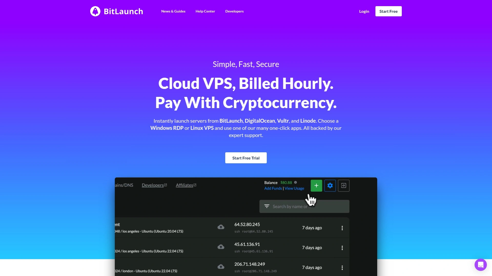

BitLaunch最大的特点是整合了DigitalOcean、Vultr、Linode等多家知名基础设施供应商,让你在一个平台上就能部署来自不同服务商的服务器。支持按小时付费,接受比特币等多种加密货币,无需银行卡或个人信息。平台自带27个全球数据中心位置选择,网络平均正常运行时间达99.9%,每天处理超过700次服务器启动请求。

内置一键应用安装功能特别实用,可以快速部署OpenVPN、WireGuard、Outline、Shadowsocks R等隐私工具,或者安装LAMP/LEMP、WordPress等建站环境。所有BitLaunch自有服务器以及部分合作伙伴服务器都免费包含高容量DDoS防护。操作系统选择丰富,从各种Linux发行版到Windows桌面和服务器版本都有,甚至提供Ubuntu Desktop和Windows RDP图形界面选项。平台还提供开发者API和命令行工具,方便批量管理和自动化部署。24/7真人技术支持随时在线,无论配置问题还是选型建议都能快速响应。自2017年以来已服务超过10万用户,口碑可靠。

## **[Cherry Servers](https://www.cherryservers.com)**

立陶宛高性能基础设施服务商,Web3和隐私项目首选。

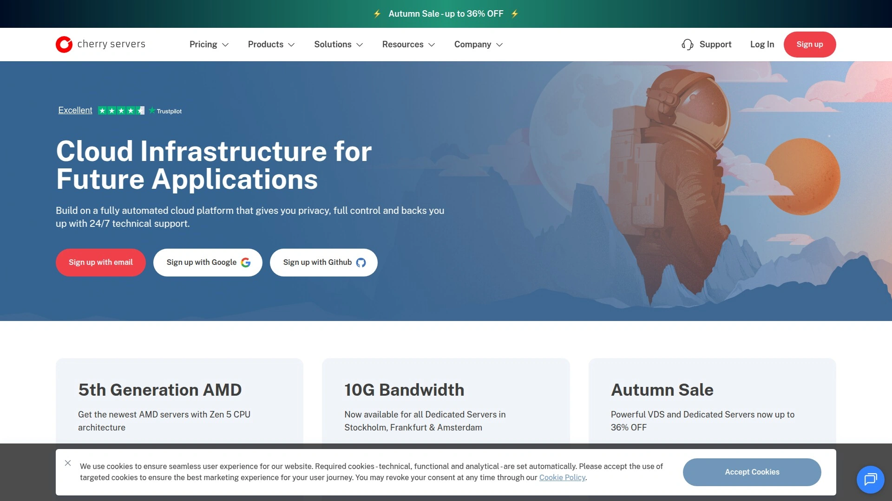

Cherry Servers在Trustpilot评分4.5分,专注于裸金属服务器和定制化解决方案。数据中心遍布美国、立陶宛、荷兰、德国、新加坡和瑞典,覆盖全球主要区域。通过CoinGate网关处理加密货币支付,接受比特币、以太坊、卡尔达诺、币安币等多种币种,目前重点转向符合欧盟法规的稳定币如USDC。所有VPS、专用服务器和云服务都支持加密货币支付,不限定特定套餐。关键是信用卡支付才需要KYC认证,加密货币支付无需身份验证,最大化保护用户隐私。提供DDoS防护、私有网络和定制控制面板,配备24/7真人支持和可选的专属客户经理,非常适合区块链、Web3和隐私敏感型业务。

## **[Vultr](https://www.vultr.com)**

全球知名SSD云服务器提供商,通过BitPay接受加密货币。

Vultr在2024年正式宣布接受比特币支付,用户在结账时选择BitPay作为支付方式即可使用比特币、以太坊、莱特币等加密货币。BitPay支持超过100种不同的钱包,包括Exodus、MetaMask、Electrum、Trust、Coinbase等主流选择。付款直接从你的加密钱包完成,无需中间环节。Vultr提供高性能SSD VPS,数据中心覆盖全球多个战略位置,网络质量稳定延迟低。计费灵活,支持按小时付费,随时可以创建或销毁实例。界面简洁易用,适合从个人开发者到企业用户的各类需求。

## **[Hostwinds](https://www.hostwinds.com)**

美国西雅图服务商,提供托管和非托管VPS多种选择。

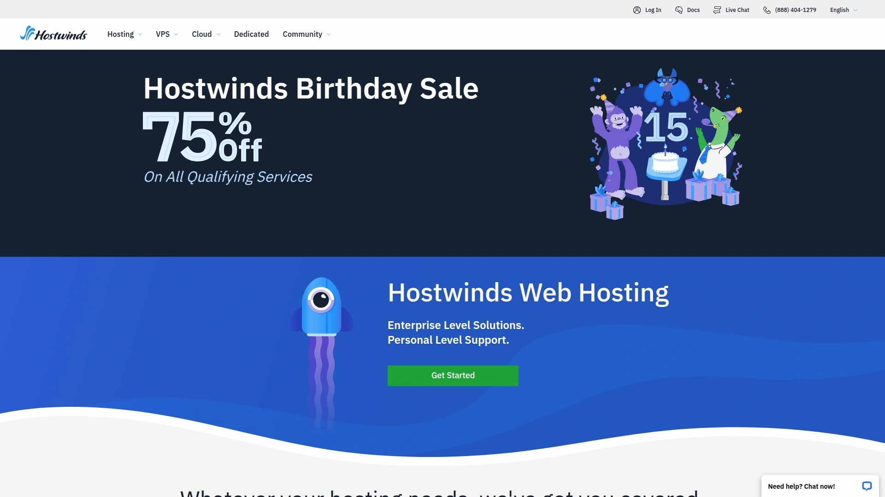

Hostwinds在G2评分4.9分,在Trustpilot获得3.3分评价,以高性价比和优质客户支持著称。数据中心位于美国两地和荷兰阿姆斯特丹,共三个位置。接受比特币、以太坊、莱特币、比特币现金等多种加密货币支付,无需KYC认证保护用户隐私。需要注意的是加密货币支付无法自动续费,用户需要在到期日前手动支付账单。提供完整root访问权限、SSD存储和许多套餐的无限带宽。托管VPS包含24/7服务器监控、操作系统和控制面板安装服务,适合不想处理技术细节的用户。非托管VPS则给予完全控制权,适合有技术能力的开发者和企业。

## **[VIKHOST](https://www.vikhost.com)**

乌克兰平价VPS服务商,Trustpilot评分4.7分。

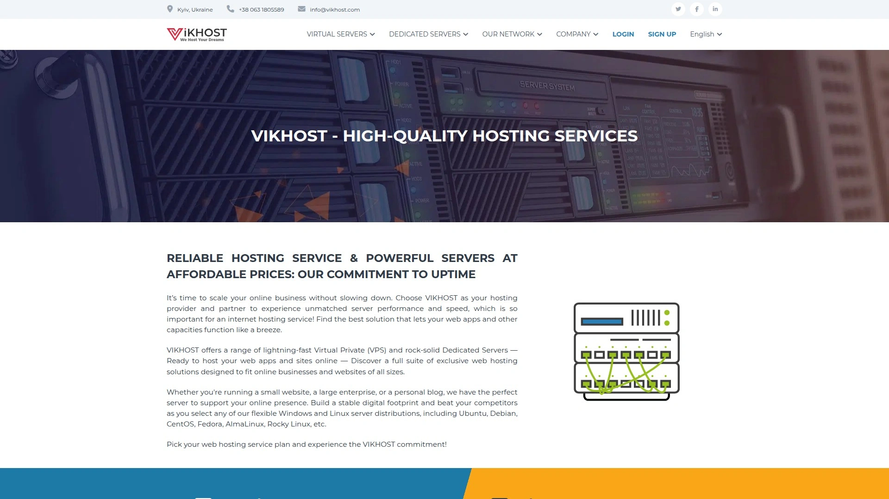

VIKHOST主打性价比,提供乌克兰、瑞典和荷兰数据中心的VPS和专用服务器。所有服务器提供root访问权限,硬件质量可靠价格实惠。接受比特币、莱特币、门罗币、以太坊、波场币、狗狗币等多种加密货币,加密支付无需KYC认证,确保交易安全且匿名。特别适合隐私导向用户、区块链开发者和需要匿名主机的项目。同时也吸引预算有限的中小企业和初创公司。提供Linux VPS和Windows VPS多种配置选择。需要注意备份服务需要额外付费,购买前应确认清楚。另外加密货币支付不可退款,提交付款前务必仔细核对账单信息。

## **[1984 Hosting](https://1984.hosting)**

冰岛最大网络主机商,以道德实践和绿色能源著称。

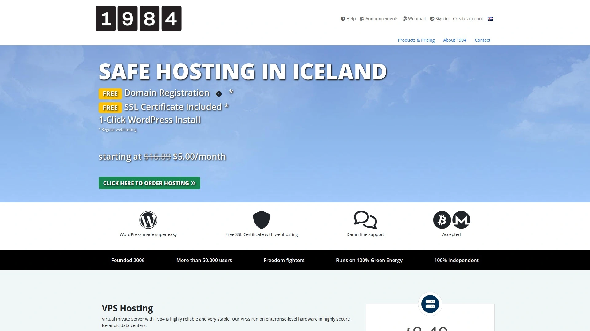

1984成立于2006年,位于冰岛这个隐私法律最友好的国家之一。公司承诺使用100%可再生绿色能源,数据中心位于冰岛安全设施内,网络正常运行时间达到100%持续16年的记录。提供传统虚拟主机、VPS托管和免费DNS服务,所有虚拟主机套餐包含免费SSL证书和免费.com域名注册。VPS服务运行在企业级硬件上,可靠性和稳定性出色,购买后几秒内即可启动使用。自动安装镜像支持OpenVPN、LEMP、Debian、Ubuntu等多种系统。公司强调唯一真正不记录日志的VPN是你完全控制的VPN,因此很多隐私意识强的用户选择在1984上自建VPN。FreeDNS服务完全免费,可以托管任意数量域名无任何限制,还提供DDoS保护和自动DNSSEC处理。选择尽可能使用自由软件,体现了公司的道德价值观。

## **[Njalla](https://njal.la)**

全球最知名隐私服务商,提供域名、VPS和VPN服务。

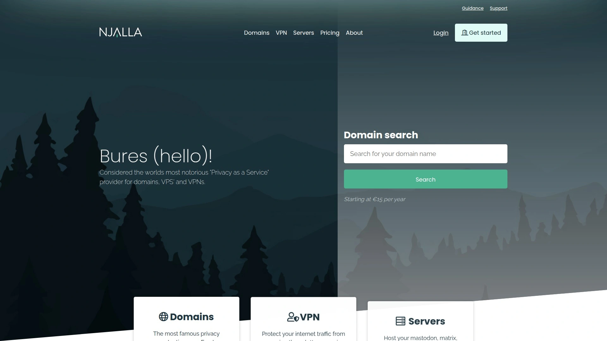

Njalla由海盗湾联合创始人Peter Sunde创立,专注于为用户提供最大程度的匿名性和隐私保护。服务包括域名注册、VPS主机和VPN,所有服务设计理念都围绕隐私至上。域名注册时Njalla作为注册人出现在公开记录中,真正用户信息完全隐藏,这在需要匿名建站的场景中极具价值。VPS服务同样强调隐私,接受加密货币支付,最小化用户信息收集。虽然价格比普通主机商略高,但对于记者、活动家、举报人和加密货币相关业务来说,这种隐私级别是不可替代的。公司在隐私社区享有盛誉,是真正将言论自由和数字隐私放在首位的服务商。

## **[Cloudzy](https://cloudzy.com)**

提供100%隐私保证的匿名VPS,支持全球10+热门位置。

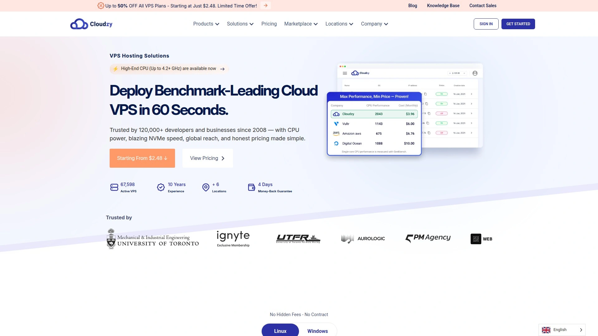

Cloudzy深度关注个人信息和支付隐私,提供多种支付方式包括比特币、以太坊、门罗币和达世币等加密货币。门罗币和达世币支付可实现完全匿名,比特币和以太坊则提供伪匿名保护。无需信用卡即可购买VPS,交易费用低且固定。采用最新NVMe SSD存储和DDR4 RAM硬件,保证99.95%正常运行时间,1 Gbps网络连接提供高带宽低延迟。每台VPS配备专用静态IP地址,从开始到结束IP永不改变。用户友好的控制面板让配置和自定义变得简单直观。所有Windows服务器版本和Linux发行版免费预装,价格从每月4.95美元起步,性价比极高。包含DDoS防护和完整管理员/Root访问权限,24/7客户支持随时待命,还提供退款保证让购买无风险。

## **[Shinjiru](https://www.shinjiru.com)**

马来西亚离岸主机专家,获HostAdvice"十大离岸主机"奖项。

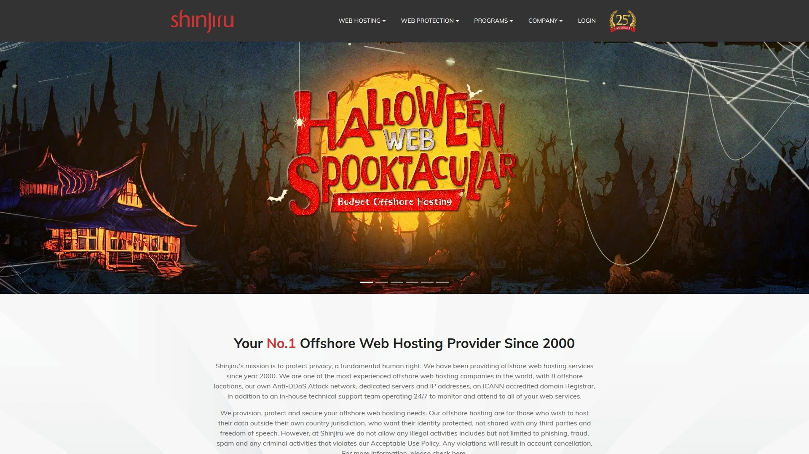

Shinjiru自2000年起部署离岸服务器,在隐私和言论自由领域经验丰富。提供共享主机、VPS和专用服务器,所有服务都接受比特币等加密货币支付,无需银行卡或个人详细信息。匿名注册只需有效电子邮件地址和密码,大幅降低身份暴露风险。数据中心分布在马来西亚、荷兰、保加利亚等隐私友好司法管辖区,适合加密货币交易所、游戏平台、电商网站等高风险业务。VPS采用SSD存储提供更快读写速度,专属资源确保性能稳定不受其他用户影响,网络优化降低延迟特别在亚洲和欧洲表现出色。DDoS防护能力高达1.5 Tbps,可抵御大规模网络攻击,实时监控检测并阻止恶意流量,多层防御和可定制保护满足高级用户需求。物理数据中心安全措施严格,24/7技术支持响应迅速。

## **[OrangeWebsite](https://orangewebsite.com)**

冰岛网络托管服务商,强调言论自由和100%匿名性。

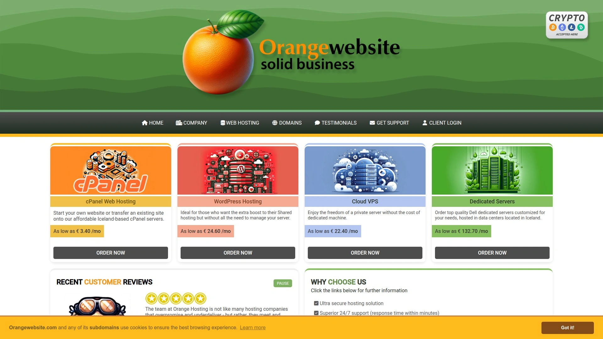

OrangeWebsite自2009年成立以来快速成长为冰岛最大的主机商之一。地理位置优势明显,冰岛拥有现代化的言论自由法律和更强的隐私保护,公司数据中心100%使用可再生能源运营,环保又高效。接受比特币和PayPal支付,用户可以完全匿名注册和使用服务,提供30天退款保证。服务包括共享主机、WordPress主机、云VPS和专用服务器,价格亲民共享主机低至每月3.40欧元起。24/7专业支持团队全年无休,客户来自全球100多个国家。多年来用户评价支持团队响应速度快且准确,100%推荐。所有主机方案运行在高性能cPanel服务器上,易于管理。适合重视言论自由、需要匿名托管和关注环保的个人及企业用户。

## **[ClientVPS](https://www.clientvps.com)**

离岸VPS专家,系统设计完全保护用户隐私。

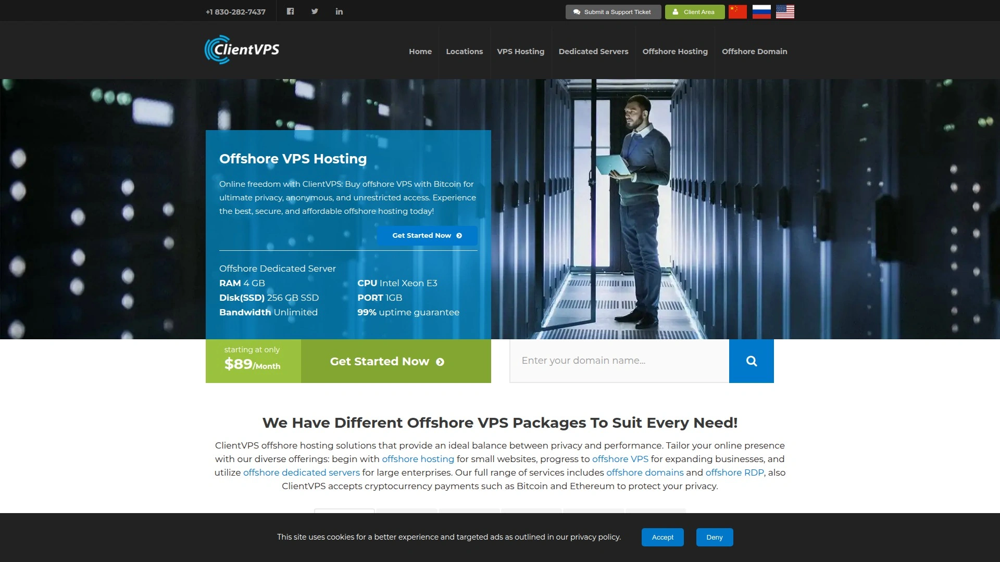

ClientVPS的服务系统从购买到使用全程不要求客户提供任何个人信息,真正实现匿名托管。接受比特币、门罗币、莱特币、以太坊、Perfect Money、WebMoney、Payeer和泰达币USDT等多种加密货币和电子货币。离岸托管是指将网站和应用放置在外国领土服务器上,目的是获得更好的隐私保护和言论自由。离岸VPS为用户提供隐私功能、可扩展性、增强安全性以及摆脱本地限制,适合开发全球化服务。比特币VPS托管服务让用户通过比特币交易购买服务器空间,既保持隐私又掌控加密货币交易。提供增强隐私保护和最少内容限制,非常适合匿名运营和专业内容托管需求。

## **[Servers.Guru](https://servers.guru)**

快速可靠的匿名主机,月付4.99欧元起步。

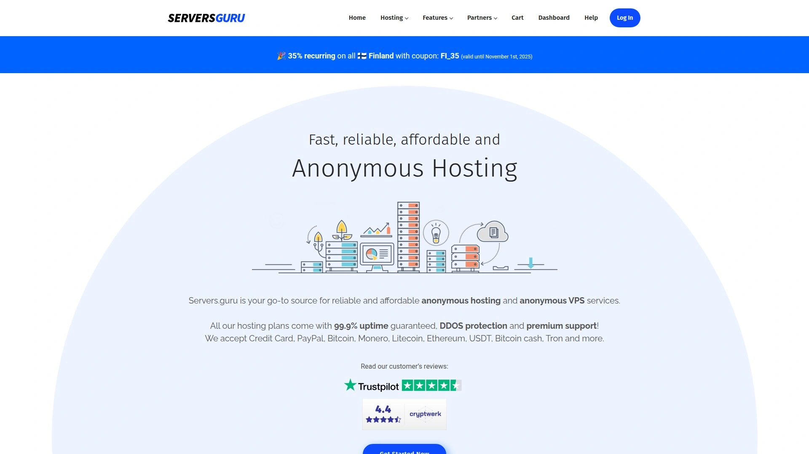

Servers.Guru主打匿名托管服务,强调速度和可靠性。价格非常有竞争力,基础套餐从每月4.99欧元开始,适合预算有限但又需要隐私保护的用户。接受多种加密货币支付,注册流程简化到最低限度,不收集不必要的用户信息。服务器性能稳定,网络连接质量优秀,适合各种应用场景从个人博客到小型商业网站。用户界面简洁明了,即使是初学者也能快速上手。提供多个数据中心位置选择,可以根据目标受众地理位置选择最优节点降低访问延迟。技术支持团队专业且响应及时,遇到问题能够快速解决。

## **[Coin.Host](https://coin.host)**

专为比特币和加密货币社区设计的安全网络托管。

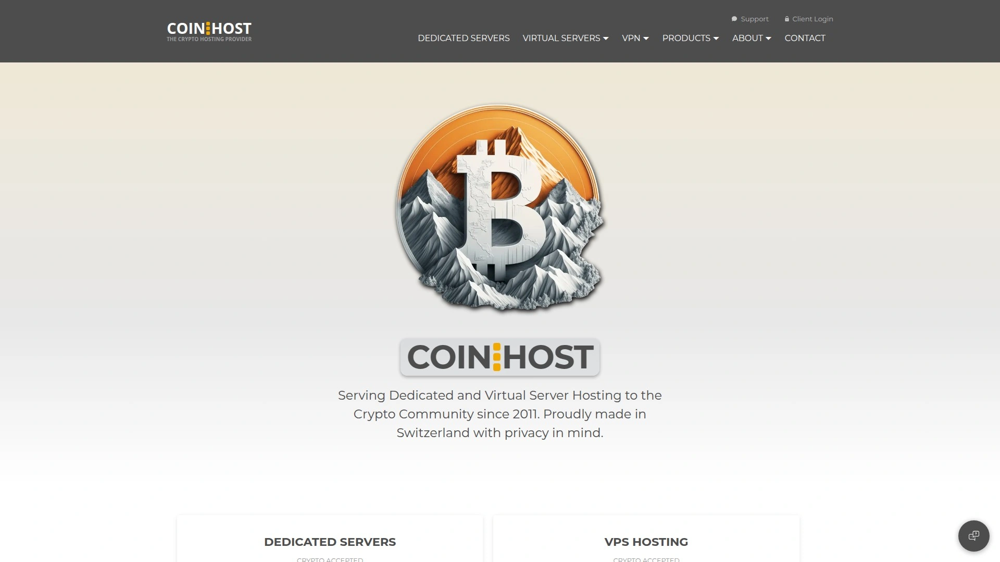

Coin.Host完全面向加密货币用户,从命名就能看出其定位。提供安全的网络托管解决方案,接受比特币及其他主流加密货币支付。服务针对加密货币相关项目优化,无论是区块链应用、加密钱包网站还是交易信息平台都能得到良好支持。重视安全性和正常运行时间,采用先进的安全措施保护用户数据和网站免受攻击。价格透明合理,按需选择配置避免浪费。用户群体主要是加密货币爱好者、区块链开发者和相关企业,社区氛围浓厚。提供详细的文档和教程帮助用户充分利用托管服务,技术支持人员对加密货币领域有深入理解,能提供专业建议。

## **[Abelohost](https://abelohost.com)**

比特币VPS托管服务,注重用户隐私和付款灵活性。

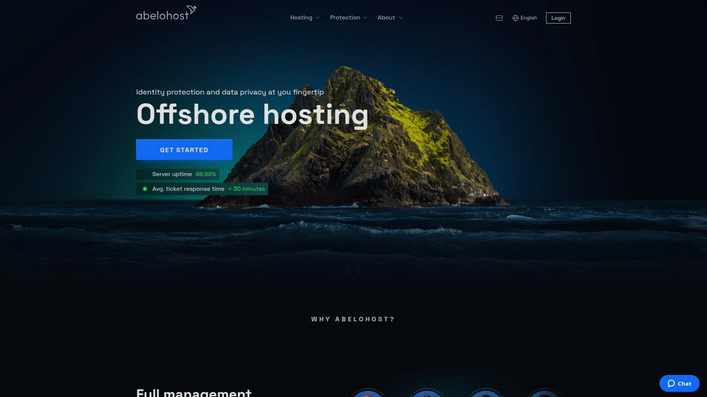

Abelohost专注于接受比特币支付的VPS服务,为重视隐私的用户提供可靠托管选项。服务器配置灵活,从入门级到高性能都有覆盖,满足不同规模项目需求。使用比特币支付不仅保护财务隐私,还能避免传统银行系统的限制和审查。数据中心位置选择合理,网络质量稳定,适合长期运行关键业务。控制面板功能完善,服务器管理、监控和配置都能轻松完成。客户服务响应迅速,对技术问题处理专业。价格相对公道,性价比在同类服务中处于中上水平。定期备份选项帮助用户保护数据安全,避免意外丢失造成损失。

## **[VSYS Host](https://vsys.host)**

100%隐私驱动的完全匿名VPS托管服务。

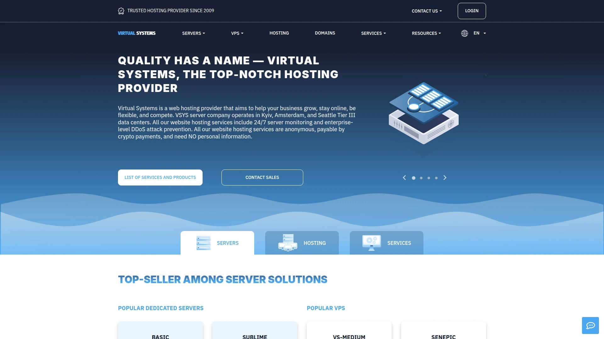

VSYS Host将其服务描述为隐私驱动且完全匿名的VPS托管,用户可以在不透露身份的情况下使用虚拟专用服务器,只需提供电子邮件用于沟通,无需进一步信息。接受比特币、莱特币、以太坊等加密货币支付,可以实现完全匿名付款。廉价匿名VPS托管是需要高级托管解决方案但负担不起专用服务器或不想处理裸机复杂性的用户的最佳选择。匿名购买VPS意味着获得自己的虚拟服务器环境,对操作系统、软件扩展及其所有设置拥有100%控制权。每个匿名VPS实例分配关键资源包括CPU核心、RAM数量和存储空间。专业和商业用户通常更喜欢VPS而不是共享主机。如果没有找到想要的匿名离岸VPS,可以联系客服寻求帮助或定制服务器解决方案。

## **[Lyra Hosting](https://lyrahosting.com)**

离岸托管服务商,提供10Gbps服务器和比特币托管。

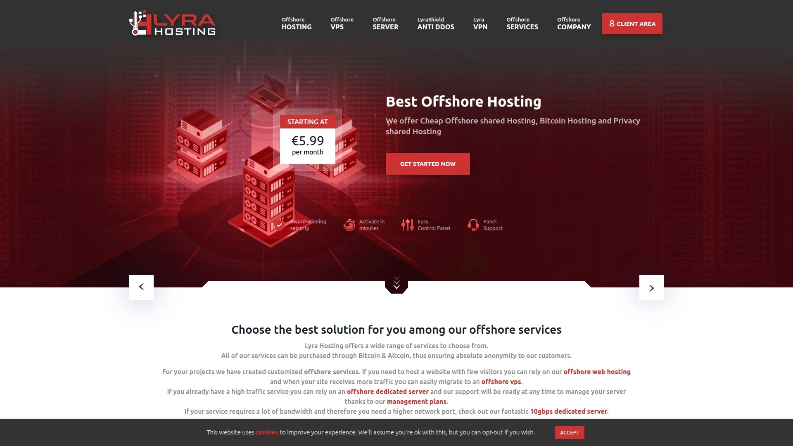

Lyra Hosting强调高隐私和匿名性的比特币支付方式,通过安全的VPS比特币托管服务保护用户身份和财务信息免受黑客窥探。所有比特币托管套餐都配备高级安全增强功能,以最实惠的价格享受优质网络功能。所有比特币交易通过军用级加密实践安全保护,确保最高级别防护。所有比特币托管套餐都包含先进的反DDoS保护服务,提供尖端托管体验。10Gbps服务器提供超高带宽,适合流量密集型应用和大规模数据传输需求。离岸位置结合高带宽和强大的安全措施,使Lyra Hosting成为需要高性能且注重隐私用户的理想选择。

## **[Evolution Host](https://evolution-host.com)**

专业比特币VPS服务商,支持Linux和Windows系统。

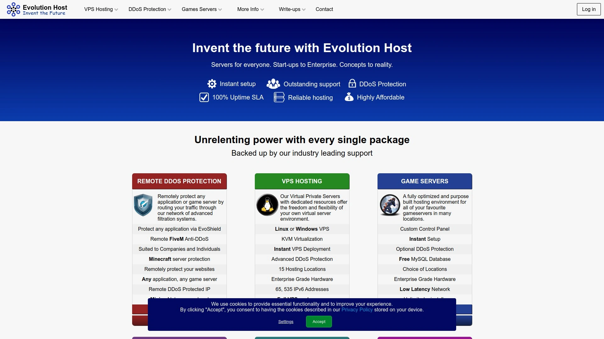

Evolution Host提供的比特币VPS让用户能够留在比特币生态系统内同时享受高性能虚拟化。基础设施专为可靠性和速度设计,是项目的完美承载平台。比特币支付确认后立即部署服务器,通常只需几分钟取决于网络状况。全球多个位置确保低延迟,提供企业级DDoS防护,24/7技术支持团队熟悉比特币相关需求。用户可以运行完整的比特币节点、闪电网络节点或任何其他区块链软件,VPS套餐提供足够的存储、带宽和性能支持这些节点的长期运行。比特币支付增强隐私性,不需要信用卡或银行信息,不过结账时仍需提供姓名和地址。提供完整root访问权限和专用资源,硬件针对托管加密货币项目和区块链应用优化。

## **[NiceVPS.net](https://nicevps.net)**

不受审查的托管服务,专注隐私保护VPS。

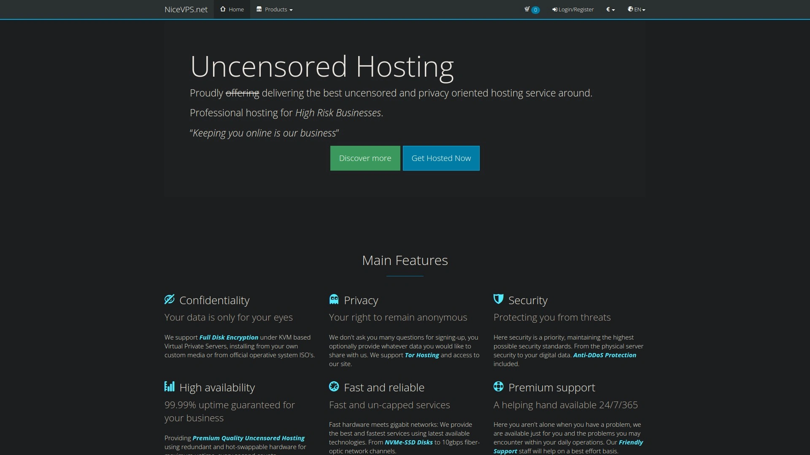

NiceVPS.net提供不受审查的托管和隐私托管解决方案,服务定位明确针对需要言论自由和内容保护的用户。接受加密货币支付,支持匿名注册和使用,最大限度减少个人信息暴露风险。数据中心选择在对内容审查相对宽松的司法管辖区,用户可以托管在其他地方可能受限的内容,前提是符合当地法律。VPS性能可靠,配置选项多样,从小型个人项目到中等规模商业应用都能满足。价格合理透明,没有隐藏费用,按月或按年付费都有优惠。用户评价普遍认为服务稳定,客户支持专业,特别是在处理隐私相关咨询时表现出色。适合内容创作者、活动组织者和需要保护表达自由的各类用户。

## **[CrazyRDP](https://crazyrdp.com)**

匿名服务器和云托管服务商,提供RDP解决方案。

CrazyRDP专注于提供匿名服务器和云托管,特别强调远程桌面协议RDP服务。用户可以获得Windows RDP服务器,通过加密货币匿名购买和使用。适合需要Windows桌面环境进行特定工作或测试的用户,比如运行Windows专用软件、进行自动化任务或需要固定IP的远程办公场景。接受比特币等加密货币支付,注册简单不需要繁琐的身份验证。服务器位置分布合理,连接速度快延迟低,远程桌面体验流畅。提供不同配置级别的RDP服务器,从基础到高性能都有,价格根据配置浮动但总体处于市场中等水平。技术支持可通过多种渠道联系,问题解决效率较高。

## **[Hostinger](https://www.hostinger.com)**

全球知名主机商,立陶宛成立支持加密货币续费。

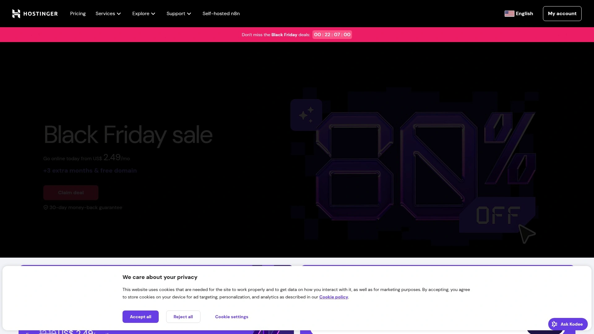

Hostinger成立于2004年,总部位于立陶宛,是全球知名的VPS和虚拟主机提供商。VPS托管基于KVM虚拟化技术,提供价格实惠、性能稳定和灵活配置的云服务器。采用NVMe SSD存储和AMD EPYC处理器,确保数据读写速度和计算性能。接受多种支付方式包括信用卡、借记卡、电子钱包和加密货币,不过需要注意加密货币支付目前仅适用于续费服务。控制面板简单易用,即使是初学者也能快速掌握服务器管理。提供多个数据中心位置选择,网络连接质量优秀正常运行时间有保障。价格极具竞争力,经常有促销活动,适合预算有限的个人用户和小型企业。24/7客户支持通过实时聊天和工单系统提供帮助,响应速度快问题解决能力强。

## **[BaCloud](https://www.bacloud.com)**

提供比特币VPS托管的云服务平台。

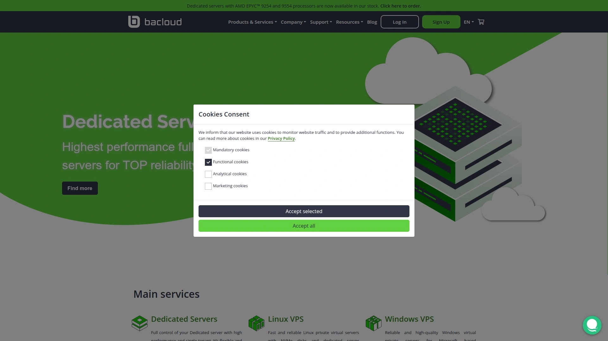

BaCloud提供接受比特币支付的VPS托管服务,面向需要使用加密货币租用服务器的用户群体。服务定位清晰,针对隐私意识强和偏好去中心化支付方式的客户。VPS配置灵活,用户可以根据实际需求选择CPU、内存、存储和带宽组合,避免资源浪费。支持多种操作系统安装,Linux和Windows都有覆盖,满足不同技术栈需求。比特币支付流程简化,确认速度相对较快,用户体验友好。数据中心网络质量稳定,适合运行长期在线服务。价格处于市场中等偏下水平,性价比不错。提供基本的技术文档和常见问题解答,帮助用户自助解决大部分问题,客服支持也可通过邮件或工单联系。

## **[CCIHosting](https://www.ccihosting.com)**

离岸网络托管服务商,支持加密货币购买VPS。

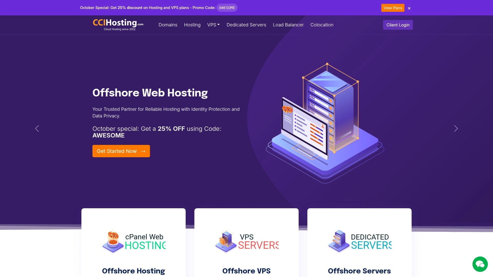

CCIHosting专注于离岸网络托管服务,提供接受加密货币支付的VPS解决方案。离岸托管的优势在于更宽松的内容政策和更强的隐私保护,适合某些特定行业和应用场景。接受比特币等主流加密货币,支付过程匿名化程度高。服务器配置从入门到高级都有,可以根据项目规模和预算灵活选择。数据中心位于隐私友好的司法管辖区,用户数据受到当地法律更好的保护。网络性能稳定,正常运行时间达到行业标准水平。控制面板功能全面,服务器管理、监控、备份等操作都能方便完成。客户支持团队有离岸托管经验,能够理解并满足特殊需求。价格合理,与提供的服务和隐私保护级别相匹配,适合需要离岸VPS的各类用户。

***

## 常见问题

**使用比特币支付VPS有什么优势?**

比特币支付最大的优势是保护隐私和财务匿名性,不需要提供信用卡、银行账户或个人身份信息。交易通过区块链完成,去中心化特性意味着没有中间机构可以冻结或审查你的支付。对于跨境交易来说,加密货币还能避免汇率损失和高额手续费,大部分服务商确认后几分钟内就能开通服务器。

**这些VPS服务商是否真的不记录用户信息?**

大部分接受加密货币的VPS服务商承诺最小化信息收集,但具体程度因公司而异。像Njalla、ClientVPS、VSYS Host这类专注隐私的服务商通常只要求电子邮件地址,不收集真实姓名和地址。然而部分主流服务商如Vultr、Hostinger即使接受加密货币,结账时仍可能要求基本个人信息。建议根据自己的隐私需求选择对应级别的服务商,并仔细阅读隐私政策。

**加密货币支付的VPS可以自动续费吗?**

大多数情况下不可以。由于加密货币交易的特性和波动性,绝大部分服务商要求用户在到期前手动支付续费账单,无法像信用卡那样设置自动扣款。Hostwinds明确说明加密货币支付用户需要在到期日前手动处理账单,这是行业普遍做法。建议设置日历提醒,提前几天支付续费避免服务中断。部分平台如BitLaunch采用预付费余额模式,充值后按小时扣费相对灵活。

***

## 结语

选择支持加密货币支付的VPS服务商,核心要看隐私保护级别、数据中心位置和性价比三个维度。如果你需要一站式管理多个服务商资源,同时享受按小时付费的灵活性,[BitLaunch](https://bitlaunch.io)整合了DigitalOcean、Vultr、Linode等顶级基础设施,免费DDoS防护加上一键应用部署,特别适合需要快速启动项目且重视隐私的开发者和企业用户。记得选择靠谱的服务商,保管好你的服务器凭证和加密钱包,就能安心享受匿名云计算带来的自由。
